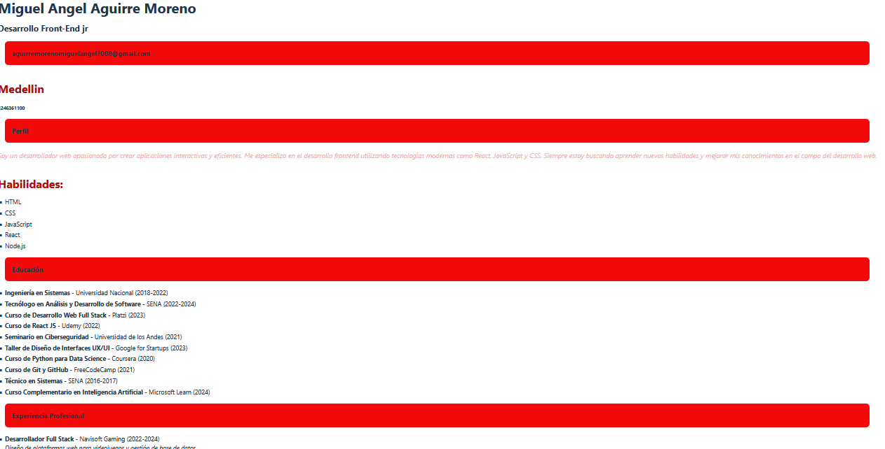

# CV - MIGUEL-AGUIRRE

En este ejercicio vamos a cambiar el contenido de Experiencia.jsx,Educacion.jsx y StackTecnologias.jsx aplicandoles renderizados condicional y de listas

🖼️ Vista Previa

.

## 📁 Estructura del proyecto
src/
├── components/
│ ├── Cabecera.jsx
│ ├── Cabecera.css
│ ├── Perfil.jsx
│ └── Perfil.css
├── App.jsx
├── main.jsx
└── index.css
public/
├── index.html

## 🚀 Instalación

1. Clona este repositorio:

```bash
git clone https://github.com/miguelucho425526/cv.2-Miguel-Aguirre/

🧠 Tecnologías
React

Vite

CSS


